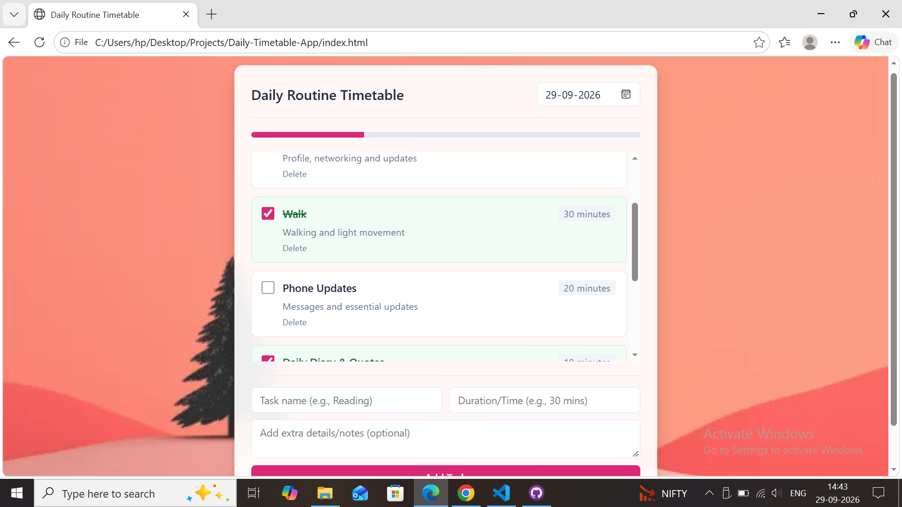

# 🌷 Daily Routine & Productivity Tracker

A simple daily checklist designed to balance **studies, career development, personal growth, creativity, health, and relaxation**. This routine has no fixed timings, so activities can be completed in a flexible order.

  

## 🎯 Daily Goals

* Stay consistent with studying and academic progress.
* Build and maintain projects.
* Explore career devlopment, jobs, and internships.
* Make time for reading, creativity, and spirituality.
* Maintain a healthy balance between productivity and personal care.

## 📅 24-Hour Daily Checklist

| Done | Activity                                      | Daily Time |
| ---- | --------------------------------------------- | ---------: |
| ☐    | 😴 Sleep                                      |    7 hours |
| ☐    | 📚 Study                                      |    8 hours |
| ☐    | 📱 Social Media                               | 40 minutes |
| ☐    | 🍽️ Meals, Getting Ready & Personal Care      |     1 hour |
| ☐    | 🌿 Free Time / Buffer                         | 20 minutes |

**Total: 17 hours**
**Remaining: 7 hours**

## 📌 Activity Examples

### 💻 Career & Professional Growth
Search for jobs openings, check eligibility, prepare applications, and apply.

### 📚 Learning & Academic Growth
Focus on college subjects, assignments, revision, and technical concepts.

### 🎥 Creativity & Personal Interests
Take a creative break and relax.

### 🌷 Health & Personal Well-being
Get some movement and fresh air.

## ✅ Daily Progress

* [ ] Completed my study goals.
* [ ] Worked on my projects.
* [ ] Made progress toward my career goals.
* [ ] Took care of my health and personal needs.
* [ ] Made time for creativity and reflection.

## 🌱 Weekly Reflection

At the end of each week, reflect on these questions:

1. What did I accomplish this week?
2. Which project or technical skill did I improve?
3. Which activities were difficult to complete consistently?
4. What should I change in next week's routine?

## 💗 Personal Reminder

> Consistency matters more than perfection.
> Small progress every day can lead to meaningful results.

**My goal:** Build a disciplined, skilled, confident, and balanced version of myself—one day at a time.

---

